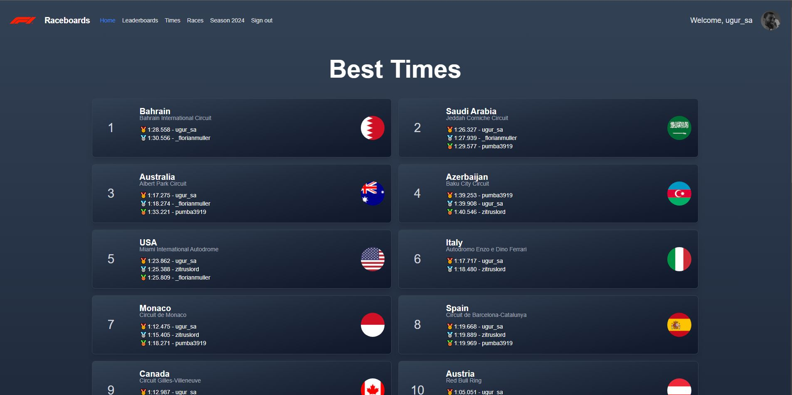

# Raceboards

This is a project I built in early 2023 for my friends and I to use while sim racing. It's a simple project that is implemented with Next.js and deployed to Vercel.

## Features

- Keep track of lap times
  

## Tech Stack

- Next.js
- Vercel
- Tailwind CSS
- Supabase
