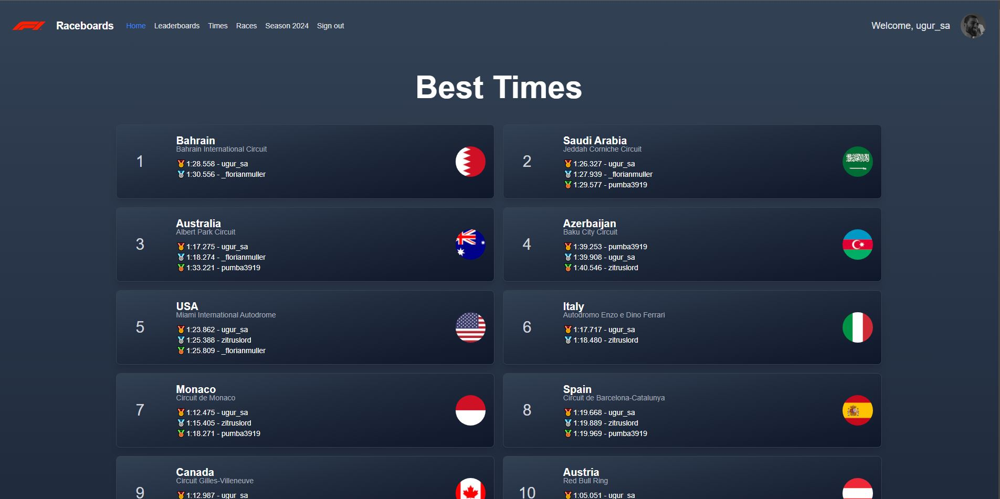

This is a project I built in early 2023 for my friends and I to use for sim racing. It's a simple project that is implemented with Next.js and deployed to Vercel.

### Features

Compare lap times on each Formula 1 track with your friends

- See medal leaderboard

- Add new lap times for each track

- Upload race results and review all sessions

- Upload races for a season to keep track of points

- See your own progress on the dashboard with a graph

- See track information and all recorded lap times in a table

### Tech Stack

For the front-end I used Next.js (pages router) with TailwindCSS. The API routes where also created in Next.js and the data is stored in a PostgreSQL database on Supabase.
